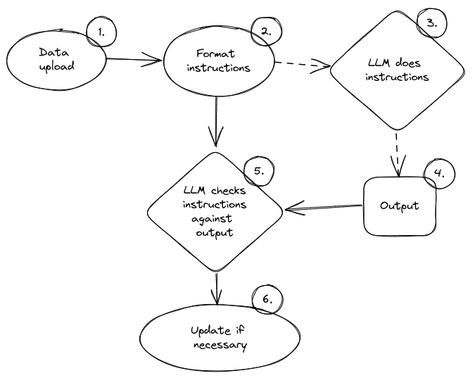

Things to do:

### Agents
- Create agents to do actor-critic style work. Look at how AutoGPT and others do this. Schematically I would think:



### More-like-this function
```python
"""
Given {data}, make {num_cards} more cards which relate to this {card}. Here is an example {more_like_this_example}.
"""
```

### Break-down-card function
```python
"""
Create {num_cards} cards from {data} which focus on breaking down this {card} into smaller pieces. Here is an {break_down_card_example}.
"""
```

### Storing a card
What is the most informative way to store a card?
- have variables, id, question, answer, date_made, attempts, successes, due_date,intervals, more-like-this, break-this-down, deleted
- Json example

```json
{
    "id": 1,
    "question": "What is the capital of France?",
    "answer": "Paris",
    "date_made": "2023-04-27",
    "attempts": 5,
    "successes": 4,
    "due_date": "2023-04-30",
    "intervals": [12, 383, 12],
    "more_like_this": [true, 
      {
        "card_id": 2
      },
      {
        "card_id": 3
      }
    ],
    "break_this_down": [
      {
        "card_id": 4
      },
      {
        "card_id": 4
      }
    ],
    "deleted": false
}
```
